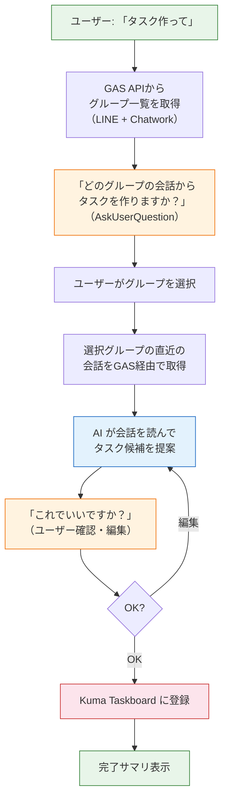
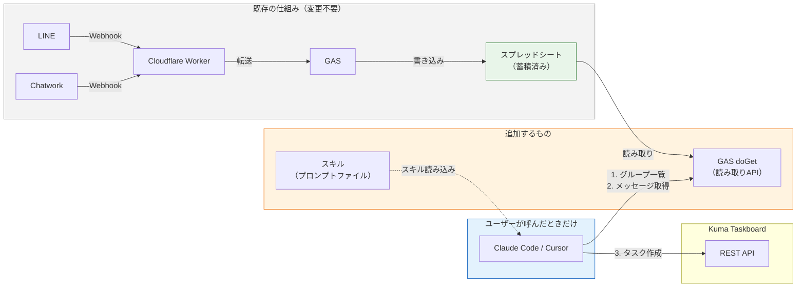
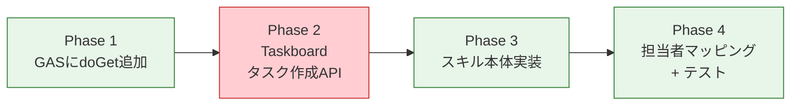

# スキル図: チャットからタスク作成

LINE・Chatworkのグループチャット会話からタスクを抽出し、Kuma Taskboardに登録するClaude Code/Cursorスキル。

---

## コンセプト

```
ユーザー: 「タスク作って」
    ↓
Claude: 「どのグループ？」（LINE / Chatwork 両方表示）
    ↓
ユーザー: グループを選ぶ
    ↓
Claude: 会話を遡って読み、タスクを提案
    ↓
ユーザー: OKまたは編集
    ↓
Claude: Kuma Taskboard に登録
```

- メッセージは既に蓄積済み（Worker → GAS → Google スプレッドシート）
- スキルはスプレッドシートのデータをGAS経由で読み取るだけ
- 既存の仕組みの変更は不要

---

## 1. 会話フロー



### 会話例

```
ユーザー: タスク作って

Claude:  どのグループの会話からタスクを作りますか？
         1. [LINE] 開発チーム
         2. [LINE] 営業部
         3. [Chatwork] プロジェクトA
         4. [Chatwork] 全体連絡

ユーザー: 1

Claude:  開発チームの直近の会話を確認しました。
         以下のタスクを提案します:

         1. LP作成
            担当: 鈴木  期限: 2/7  見積: 8h
            田中さんからの依頼。新商品のLP作成。

         2. デザインレビュー
            担当: 佐藤  期限: 2/5  見積: 2h
            鈴木さんが作成したLP案のレビュー。

         この内容でTaskboardに登録しますか？

ユーザー: 1の期限を2/10に変更して

Claude:  了解しました。LP作成の期限を2/10に変更します。
         （修正後の内容を表示）
         登録しますか？

ユーザー: OK

Claude:  Kuma Taskboard に2件のタスクを登録しました。
         - KB-15: LP作成（鈴木、2/10）
         - KB-16: デザインレビュー（佐藤、2/5）
```

---

## 2. システム構成図



---

## 3. GAS 読み取りAPI の設計（追加分）

既存のGASに `doGet` 関数を追加する。

### エンドポイント

| アクション | URL | 説明 |
|-----------|-----|------|
| グループ一覧 | `GET {GAS_URL}?action=groups` | LINE + Chatwork 全グループ一覧 |
| グループ一覧（絞込） | `GET {GAS_URL}?action=groups&source=line` | LINEのみ / `source=chatwork` でChatworkのみ |
| メッセージ取得 | `GET {GAS_URL}?action=messages&chatId={id}&limit=30` | 指定グループの直近メッセージ |

### レスポンス例

```json
// GET {GAS_URL}?action=groups
{
  "groups": [
    { "chatId": "Cxxx", "groupName": "開発チーム", "source": "line",
      "lastMessage": "2026-02-03T10:30:00" },
    { "chatId": "CW_123", "groupName": "プロジェクトA", "source": "chatwork",
      "lastMessage": "2026-02-03T09:15:00" }
  ]
}
```

```json
// GET {GAS_URL}?action=messages&chatId=Cxxx&limit=30
{
  "messages": [
    { "userName": "田中", "message": "LP作成お願いします",
      "timestamp": "1706940600000" },
    { "userName": "鈴木", "message": "金曜までにできます",
      "timestamp": "1706940720000" }
  ]
}
```

### GAS doGet 実装イメージ

```javascript
function doGet(e) {
  const action = e.parameter.action;
  const ss = SpreadsheetApp.getActiveSpreadsheet();
  const sheet = ss.getSheetByName('messages'); // シート名は実際に合わせる

  if (action === 'groups') {
    const source = e.parameter.source; // 省略時は全件
    // シートからchatIdとgroupNameのユニーク一覧を返す
    // sourceが指定されていればフィルタ
  }

  if (action === 'messages') {
    const chatId = e.parameter.chatId;
    const limit = parseInt(e.parameter.limit) || 30;
    // シートからchatId一致の行を新しい順にlimit件取得
  }

  return ContentService
    .createTextOutput(JSON.stringify(result))
    .setMimeType(ContentService.MimeType.JSON);
}
```

---

## 4. スキルの処理ステップ

### Step 1: グループ一覧取得 → 選択肢提示

```
curl "{GAS_URL}?action=groups"

→ LINE + Chatwork の全グループ一覧を取得
→ AskUserQuestion で提示:
  "どのグループの会話からタスクを作りますか？"
  [LINE] 開発チーム / [LINE] 営業部 / [CW] プロジェクトA / ...
```

### Step 2: 会話を遡って読む

```
curl "{GAS_URL}?action=messages&chatId={選択}&limit=30"

→ 直近30件の会話を取得
→ AIのコンテキストとして渡す
```

### Step 3: タスクを提案

```
AIが会話から以下を抽出:
- title: タスク名
- description: 詳細（会話の文脈を含む）
- assignee: 担当者名（会話から推定）
- due_date: 期限（会話から推定、なければnull）
- estimated_hours: 見積時間（推定）

→ ユーザーに提案として表示
```

### Step 4: ユーザーがOKまたは編集

```
OK → Step 5へ
編集 → ユーザーの指示に従い修正、再度確認
```

### Step 5: Kuma Taskboard に登録

```
curl -X POST "{KUMA_TASKBOARD_URL}/api/projects/{project}/tasks" \
  -H "Authorization: Bearer {KUMA_TOKEN}" \
  -H "Content-Type: application/json" \
  -d '{
    "title": "LP作成",
    "status_id": 1,
    "assignee_user_id": 3,
    "due_date": "2026-02-10",
    "estimated_hours": 8,
    "description": "田中さんからの依頼。..."
  }'

→ 作成されたタスクのサマリを表示
```

---

## 5. 担当者マッピング

チャットの表示名 → Kuma Taskboard の `user_id` への変換。

```
推奨フロー:
1. GET /api/projects/{project} でメンバー一覧を取得
2. 名前で自動マッチを試みる
3. マッチしない場合 → ユーザーに「この担当者は誰ですか？」と聞く
```

---

## 6. 必要な環境変数

```bash
# GAS 読み取りAPI
GAS_API_URL=                # GASのデプロイURL

# Kuma Taskboard
KUMA_TASKBOARD_URL=         # 例: https://taskboard.example.com
KUMA_TASKBOARD_TOKEN=       # 管理者が発行したAPIトークン
KUMA_TASKBOARD_PROJECT_KEY= # デフォルトプロジェクトキー（例: KB）
```

---

## 7. 前提条件

| 項目 | 状態 | 説明 |
|------|------|------|
| LINE Messaging API | ✅ 利用中 | Webhook → Worker → GAS → スプレッドシート |
| Chatwork Webhook | ✅ 利用中 | Webhook → Worker → GAS → スプレッドシート |
| スプレッドシート蓄積 | ✅ 蓄積済み | LINE + Chatwork のメッセージが保存されている |
| GAS 読み取りAPI | 🔲 要追加 | 既存GASに `doGet` 関数を追加 |
| Taskboard タスク作成API | 🔲 追加予定 | `POST /api/projects/{project}/tasks` |
| 担当者マッピング | 🔲 要検討 | チャット表示名 → Taskboard user_id |

---

## 8. 実装ロードマップ



| Phase | 内容 | 規模 |
|-------|------|------|
| **Phase 1** | 既存GASに `doGet` を追加。グループ一覧・メッセージ取得のJSON API | 小 |
| **Phase 2** | Kuma Taskboard に `POST /api/projects/{project}/tasks` 実装 | 中 |
| **Phase 3** | スキル本体（プロンプトファイル + curl呼び出し） | 小 |
| **Phase 4** | 担当者マッピング、E2Eテスト | 小 |

---

## 9. セキュリティ補足

- GAS読み取りAPIにはアクセス制限（トークン認証またはデプロイ設定）を設ける
- Workerコード内のトークン類はCloudflare Secrets（環境変数）に移行を推奨
- スキルの環境変数はプロジェクトの `.env` に保存し、`.gitignore` で除外
