# 請求書PDFを経費申請に添付する（create-invoice）

トヨクモの請求書PDFをkintoneビューアで開いてダウンロードし、Google Driveの共有フォルダ（ダンドリ企画部_請求書…）に格納します。その後、Googleフォーム（経費申請）を開き、請求書ファイルをアップロードして添付します。

途中でGoogle Meetが立ち上がる場合がありますが、このスキルではその操作は無視（何もせず閉じる/別タブに戻る）します。

## 前提条件

- Google Chrome で作業できること
- Google（Gmail / Drive / スプレッドシート / Googleフォーム）に対象アカウントでログイン済みであること
- kintoneの請求書PDF（ビューアURL or メール内リンク）にアクセスできること
- ダウンロードした請求書ファイル名の命名規則（例: `YYMMinvoice.pdf`）が決まっていること

## 手順

### Step 1: 請求書メール/リンクの起点を開く

ChromeでGmailの受信トレイを開き、対象の請求書（例: 「トヨクモ」「ご請求書」など）に関するメール、または請求書PDFに遷移できるリンクを見つけます。

**Operation Target**: Gmailの請求書メール（または請求書PDFへのリンク）

**Operation**: クリック / ナビゲーション

**Expected Result**: 請求書PDF（kintoneビューア）を開ける状態になる

**Error Handling**: 該当メールが見つからない場合は、件名/差出人で検索（例: 「トヨクモ」「請求書」）し直す。

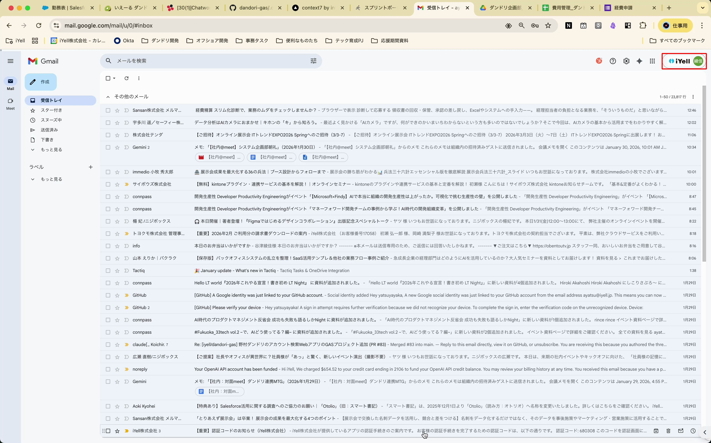

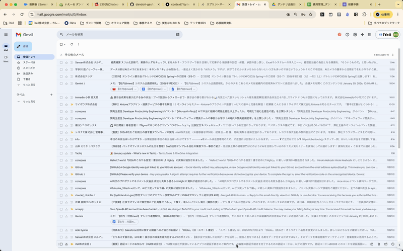

### Step 2: kintoneビューアで請求書PDFを表示する

請求書PDFのリンクを開き、kintoneのPDFビューアが表示されるまで待ちます（読み込み中は黒い画面のことがあります）。

**Operation Target**: kintone PDFビューア

**Operation**: 待機

**Expected Result**: 請求書PDFが画面上に表示される

**Error Handling**: いつまでも表示されない場合は再読み込みし、必要なら別タブで同じリンクを開き直す。

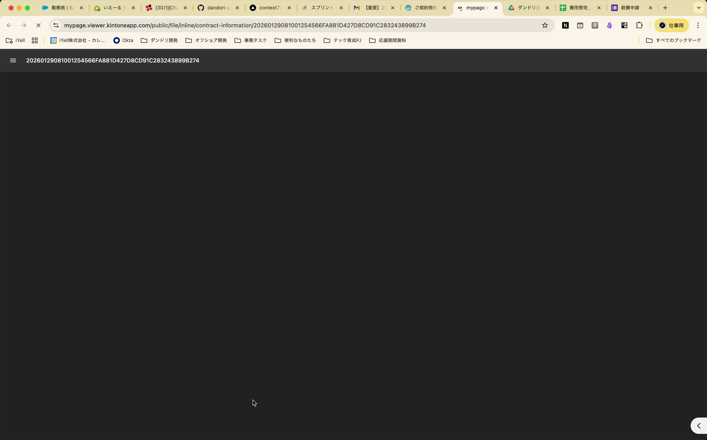

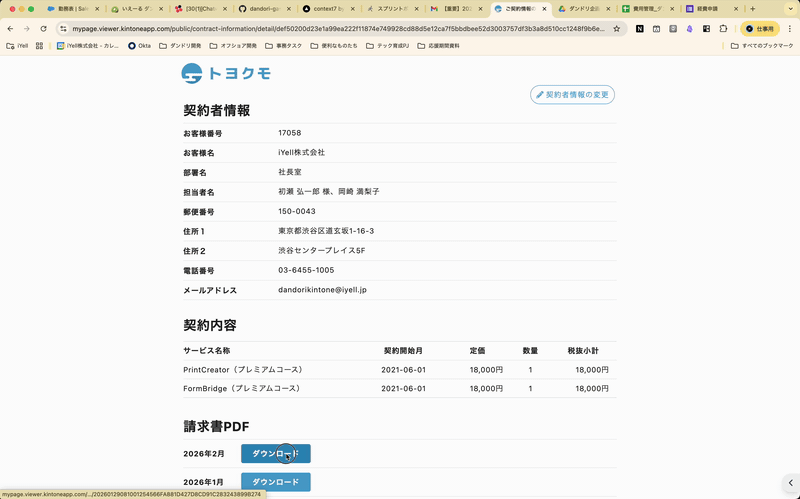

### Step 3: PDFをダウンロードする

PDFビューア上部のダウンロード（下向き矢印）をクリックして、請求書PDFの保存を開始します。

**Operation Target**: PDFビューアのダウンロードアイコン（下向き矢印）

**Operation**: クリック

**Expected Result**: 「保存」ダイアログが開く（またはダウンロードが開始される）

**Error Handling**: ダウンロードアイコンが見当たらない場合は、ビューアの右上アイコン列を確認し、表示倍率メニューなどに隠れていないか確認する。

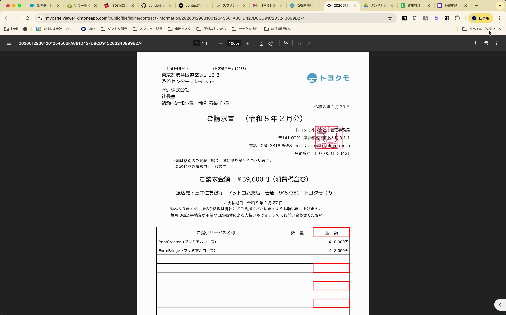

### Step 4: ファイル名を整えて保存する

「保存」ダイアログでファイル名を命名規則に合わせて設定し（例: `2602invoice.pdf`）、保存先を確認して「保存」をクリックします。

**Operation Target**: ファイル名入力欄、保存ボタン

**Operation**: 入力 / クリック

**Expected Result**: ダウンロードが開始され、指定名のPDFがローカルに保存される

**Error Handling**: 保存先が意図しない場合は「ダウンロード」フォルダ等に変更してから保存する。

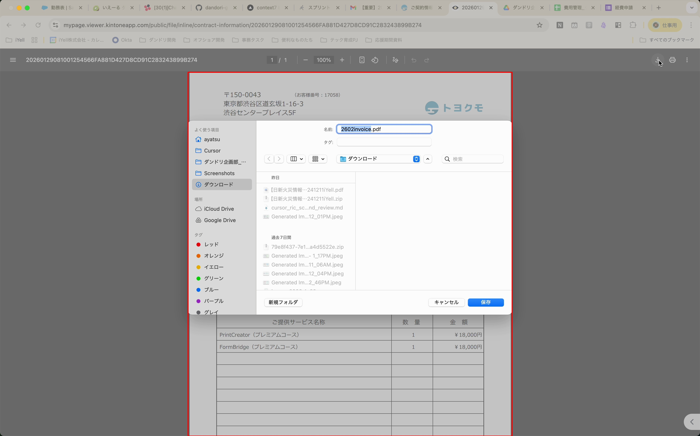

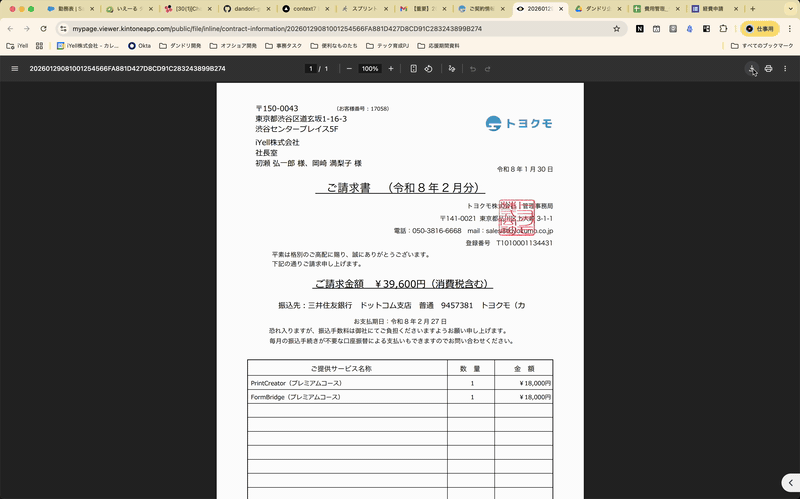

### Step 5: ダウンロード完了を確認する

Chromeのダウンロード完了通知（またはダウンロード一覧）で、請求書PDFが保存できたことを確認します。

**Operation Target**: Chromeのダウンロード通知/ダウンロードバー

**Operation**: 確認

**Expected Result**: PDFファイル（例: `2602invoice.pdf`）がローカルに存在する状態になる

**Error Handling**: 失敗している場合は再度ダウンロード操作を行い、ファイル名が重複したら末尾の (1) などを避けてリネームしてから次へ進む。

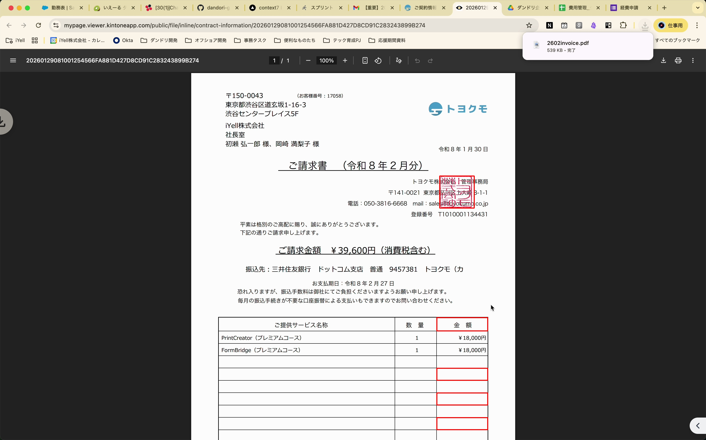

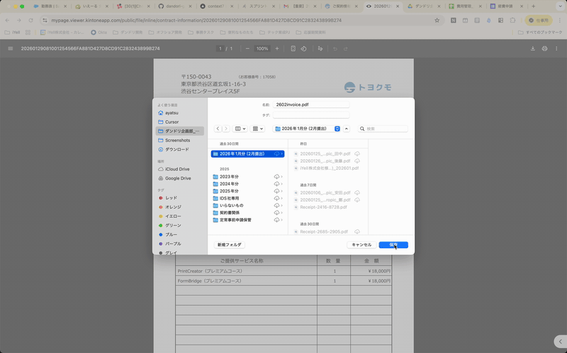

### Step 6: Google Driveの共有フォルダへ移動する

Google Driveを開き、共有アイテム内の「ダンドリ企画部_請求書…」フォルダに移動します。月次の提出先フォルダ（例: 「2026年1月分（2月提出）」など）を開きます。

**Operation Target**: 共有フォルダ「ダンドリ企画部_請求書…」→ 対象月フォルダ

**Operation**: クリック / ナビゲーション

**Expected Result**: 対象月の格納先フォルダが開いた状態になる

**Error Handling**: フォルダが見つからない場合は検索窓で「ダンドリ 企画部 請求書」などで検索する。

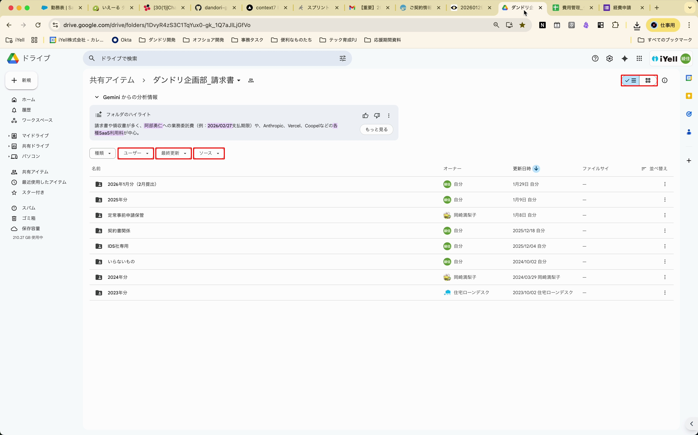

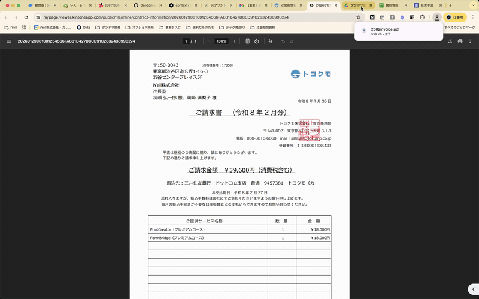

### Step 7: 経費申請の管理シートを開く（必要ならログイン確認）

スプレッドシート（現費申請_ダンドリ企画部）を開きます。Googleアカウントの確認ポップアップが表示された場合は「OK」を押して続行します。シート内の「経費申請フォーム」リンクがある場合は、それを開ける状態にします。

**Operation Target**: アカウント確認ポップアップの「OK」

**Operation**: クリック

**Expected Result**: シートを操作できる状態になる（ポップアップが消える）

**Error Handling**: 別アカウントになっている場合は「アカウントを変更」から正しいアカウントへ切り替える。

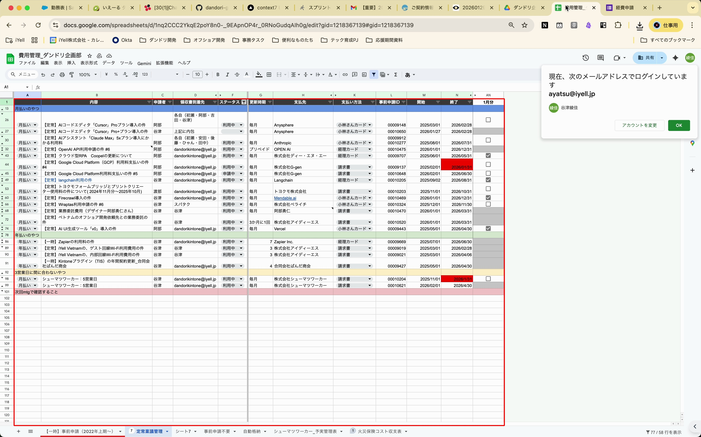

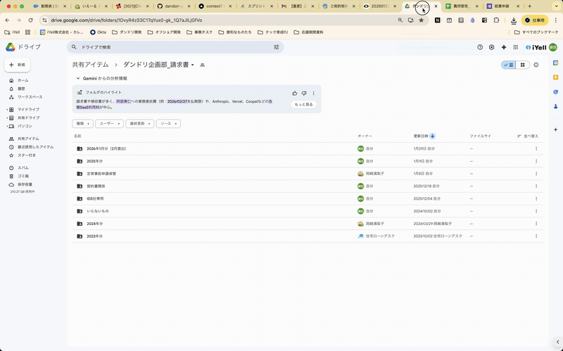

### Step 8: 経費申請フォームを開く（Googleフォーム）

Googleフォーム「経費申請」を開きます。必要に応じて、フォームの案内を確認し、種別などの必須項目があれば選択します。

**Operation Target**: 経費申請フォーム（種別のプルダウン等）

**Operation**: クリック / 選択

**Expected Result**: フォームの入力を開始できる状態になる

**Error Handling**: フォームが開けない場合は、シートのリンクを開き直すか、ログイン状態を確認する。

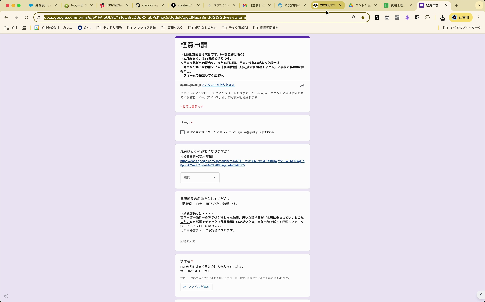

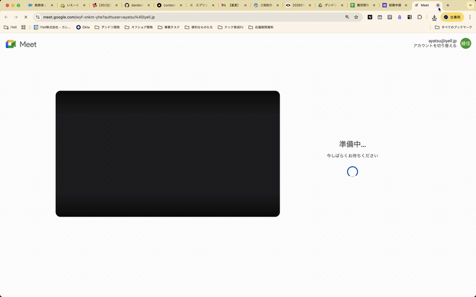

### Step 9: 請求書の内容を確認する（必要情報の転記用）

フォーム入力で必要になりそうな情報（請求月、請求金額、支払期限、振込先など）を請求書PDFで確認します。

**Operation Target**: 請求書PDF（請求金額などの記載箇所）

**Operation**: 確認

**Expected Result**: フォームに入力できる情報が揃う

**Error Handling**: PDFが表示されない場合は前のタブに戻る/再読み込みする。

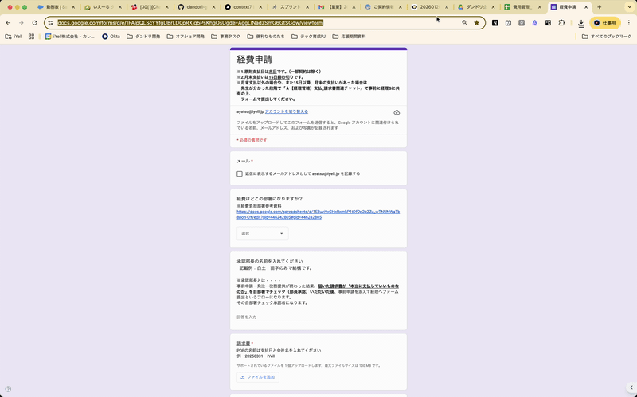

### Step 10: 管理シートで申請情報を参照する（必要なら）

スプレッドシートに戻り、経費申請に必要な情報（費目、支払日、申請先など）があれば参照します。PDFファイルのプレビューが出ている場合は、ファイル名が意図したものになっているかも確認します。

**Operation Target**: 管理シート（必要情報のセル/行）

**Operation**: 確認

**Expected Result**: フォーム入力に必要な情報が揃う

**Error Handling**: シートが重い場合は不要なタブを閉じて再試行する。

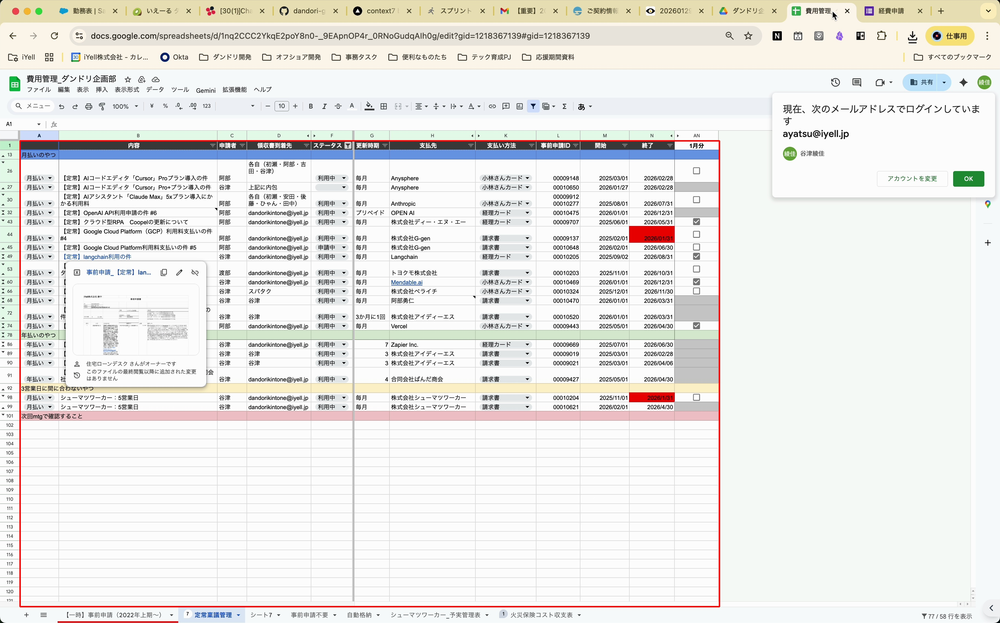

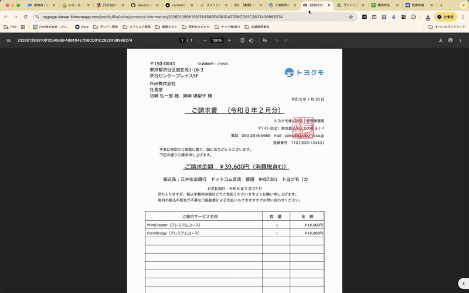

### Step 11: 経費申請フォームで「ファイルを追加」を押す

Googleフォームに戻り、請求書を添付するための「ファイルを追加」（または「ファイルを選択」）ボタンを押して、アップロード画面を開きます。

**Operation Target**: フォームの「ファイルを追加」ボタン

**Operation**: クリック

**Expected Result**: 「ファイルの挿入（アップロード）」ダイアログが開く

**Error Handling**: ボタンが見当たらない場合は、フォームを少し下へスクロールして添付欄を探す。

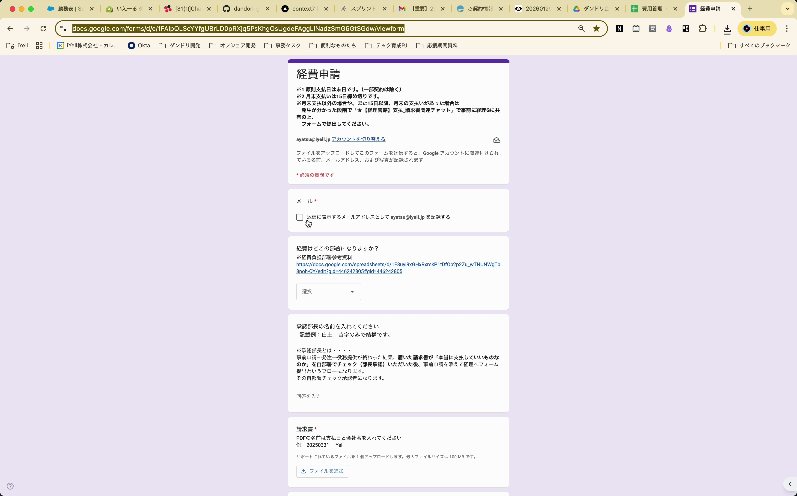

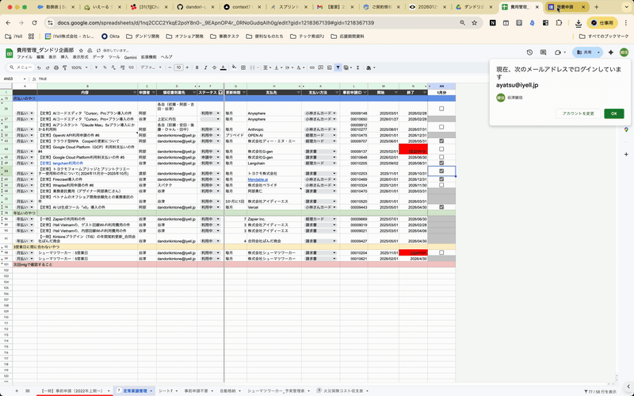

### Step 12: 請求書PDFをアップロードに追加する

アップロードダイアログで、先ほど保存した請求書PDF（例: `2602invoice.pdf`）をドラッグ&ドロップするか、「参照」からファイルを選択します。

**Operation Target**: アップロードダイアログのドロップ領域（または「参照」）

**Operation**: ドラッグ&ドロップ / クリック

**Expected Result**: アップロード対象としてPDFが追加される

**Error Handling**: ファイルが見つからない場合はダウンロードフォルダを開き直し、ファイル名で検索する。

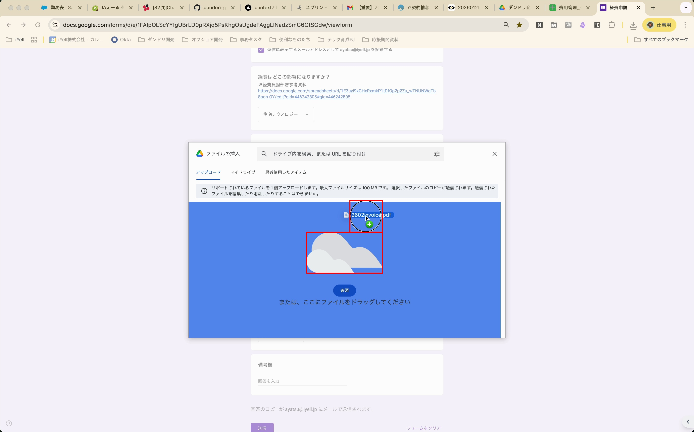

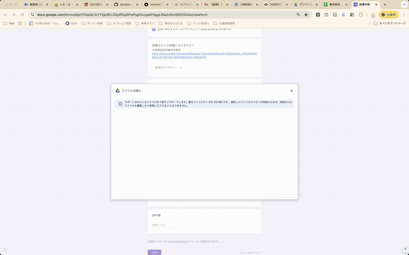

### Step 13: アップロード完了を待って添付されたことを確認する

アップロードが完了するまで待ち、フォーム側に請求書ファイルが添付されている状態になったことを確認します。最後にフォームの「送信」ボタンがある場合は、内容を確認して送信します。

**Operation Target**: アップロード進捗（完了表示）

**Operation**: 待機 / 確認

**Expected Result**: フォームに請求書PDFが添付された状態になる（必要なら送信まで完了）

**Error Handling**: アップロードが止まる場合はネットワーク状況を確認し、再試行する。サイズ制限に引っかかる場合はPDFを圧縮してから再アップロードする。

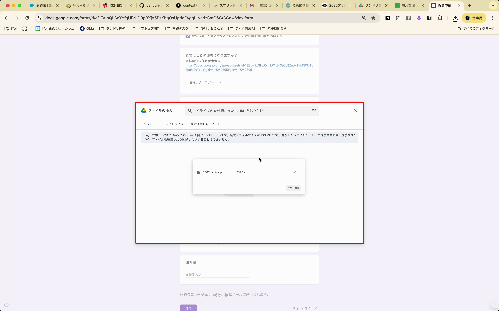

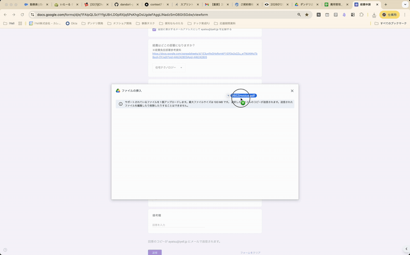

## 注意点

- Google Meetが突然開くことがありますが、このスキルでは手順対象外です（閉じる/元のタブに戻る）。
- フォームのファイルアップロードは、組織ポリシーやアカウント権限に依存します。権限不足の場合は管理者へ確認してください。
- 請求書PDFのファイル名は月次でブレないよう命名規則を固定してください（例: `YYMMinvoice.pdf`）。
